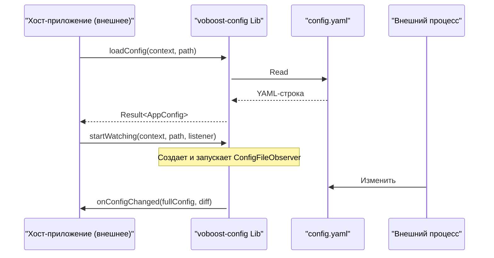

# System Patterns: voboost-config

## 1. Общая архитектура

Проект `voboost-config` представляет собой **самостоятельный модуль Android-библиотеки (`com.android.library`)**. Он не является частью мультимодульного приложения, а разрабатывается как независимый, переиспользуемый компонент.

Вся логика инкапсулирована внутри этой библиотеки. Внешние потребители, такие как `voboost-config-demo` (которое является отдельным проектом), взаимодействуют с библиотекой исключительно через её публичный API.

## 2. Ключевые компоненты библиотеки

### 2.1. `ConfigManager` (Фасад)

Это единственный публичный класс, предоставляемый библиотекой. Он инкапсулирует всю сложность и предоставляет простой API для хост-приложения.
*   **Ответственность**: Загрузка, сохранение, предоставление текущей конфигурации и управление подпиской на изменения.
*   **Дизайн**: Класс спроектирован как "stateless" (без состояния) насколько это возможно. Методы требуют `Context` и `filePath` в качестве аргументов, что делает его более предсказуемым и легким для тестирования.

### 2.2. Модели данных (`models.*`)

*   **Реализация**: Kotlin `data class` и `enum`.
*   **Ответственность**: Определяют структуру конфигурационного файла. Их использование вместе с `hoplite` обеспечивает строгую типизацию и валидацию данных на этапе загрузки.

### 2.3. `ConfigFileObserver` (Наблюдатель)

*   **Реализация**: Внутренний класс, наследующийся от `android.os.FileObserver`.
*   **Ответственность**: Мониторинг файла конфигурации на файловой системе. При обнаружении события `CLOSE_WRITE` (файл изменен и закрыт), он инициирует процесс обновления конфигурации в `ConfigManager`.

### 2.4. `OnConfigChangeListener` (Интерфейс обратного вызова)

*   **Реализация**: Публичный `interface`.
*   **Ответственность**: Определяет контракт для обратного вызова, который хост-приложение реализует для получения уведомлений об изменениях в конфигурации.

## 3. Поток данных (Data Flow)

Поток данных остается тем же, но важно понимать, что "Хост-приложение" — это внешний, независимый потребитель библиотеки.

## 4. Логика определения изменений (Diff)

Логика остается без изменений:
1.  `ConfigFileObserver` обнаруживает изменение файла.
2.  `ConfigManager` сохраняет текущую загруженную конфигурацию (`oldConfig`).
3.  `ConfigManager` загружает новую конфигурацию из файла (`newConfig`).
4.  Создается пустой объект `diffConfig` (с `nullable` полями).
5.  `ConfigManager` рекурсивно сравнивает `oldConfig` и `newConfig`.
6.  Если значение поля в `newConfig` отличается от значения в `oldConfig`, оно копируется в `diffConfig`.
7.  `listener` вызывается с аргументами `newConfig` и `diffConfig`.