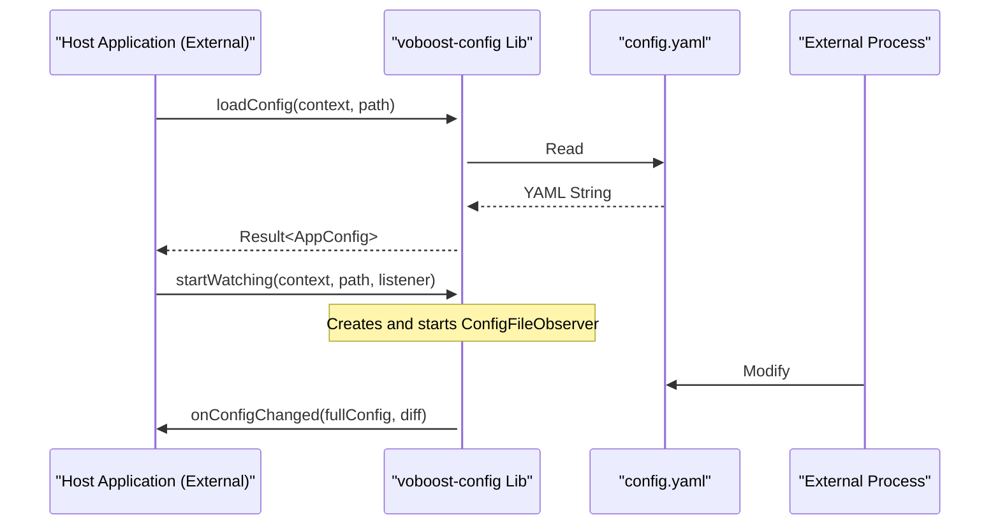

# System Patterns: voboost-config

## 1. Overall Architecture

The `voboost-config` project is a **standalone Android library module (`com.android.library`)**. It is not part of a multi-module application but is developed as an independent, reusable component.

All logic is encapsulated within this library. External consumers, such as `voboost-config-demo` (which is a separate project), interact with the library exclusively through its public API.

## 2. Key Library Components

### 2.1. `ConfigManager` (Facade)

This is the only public class provided by the library. It encapsulates all complexity and provides a simple API for the host application.
*   **Responsibility**: Loading, saving, providing the current configuration, and managing subscriptions to changes.
*   **Design**: The class is designed to be as "stateless" as possible. Methods require `Context` and `filePath` as arguments, making it more predictable and easier to test.

### 2.2. Data Models (`models.*`)

*   **Implementation**: Kotlin `data class` and `enum`.
*   **Responsibility**: Define the structure of the configuration file. Their use with `hoplite` ensures strong typing and data validation at the loading stage.

### 2.3. `ConfigFileObserver` (Observer)

*   **Implementation**: An internal class that inherits from `android.os.FileObserver`.
*   **Responsibility**: Monitors the configuration file on the filesystem. Upon detecting a `CLOSE_WRITE` event (file modified and closed), it initiates the process of updating the configuration in `ConfigManager`.

### 2.4. `OnConfigChangeListener` (Callback Interface)

*   **Implementation**: A public `interface`.
*   **Responsibility**: Defines the contract for the callback that the host application implements to receive notifications about configuration changes.

## 3. Data Flow

The data flow remains the same, but it is important to understand that the "Host Application" is an external, independent consumer of the library.

## 4. Change Detection (Diff) Logic

The logic remains unchanged:
1.  `ConfigFileObserver` detects a file change.
2.  `ConfigManager` stores the currently loaded configuration (`oldConfig`).
3.  `ConfigManager` loads the new configuration from the file (`newConfig`).
4.  An empty `diffConfig` object is created (with `nullable` fields).
5.  `ConfigManager` recursively compares `oldConfig` and `newConfig`.
6.  If a field's value in `newConfig` differs from the value in `oldConfig`, it is copied to `diffConfig`.
7.  The `listener` is called with the `newConfig` and `diffConfig` arguments.